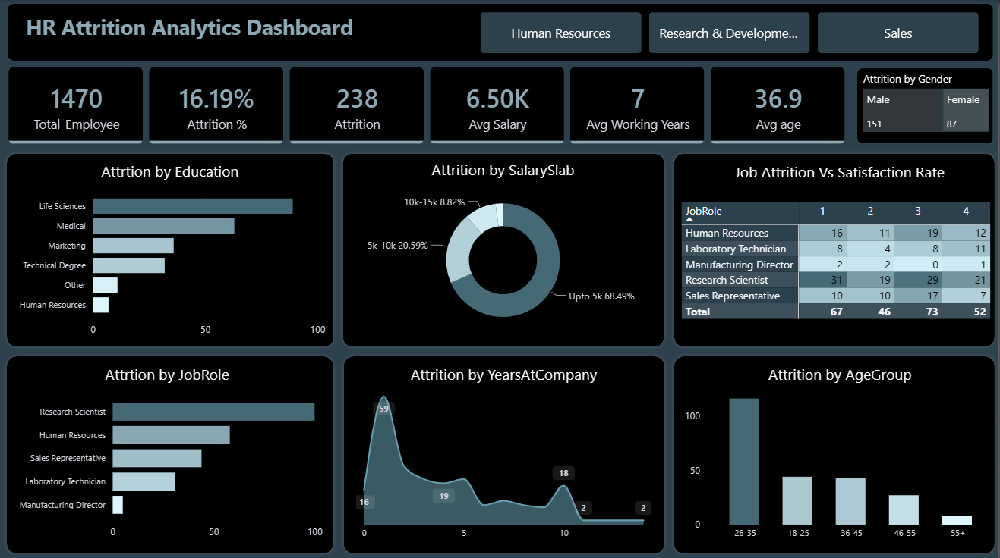
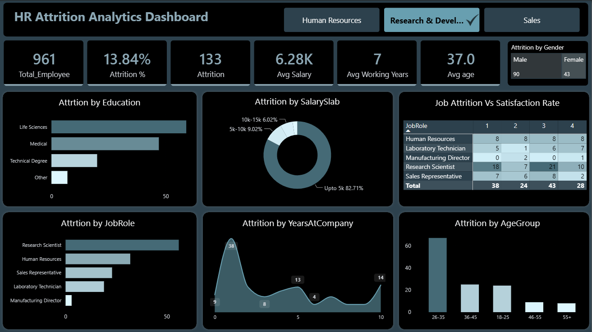
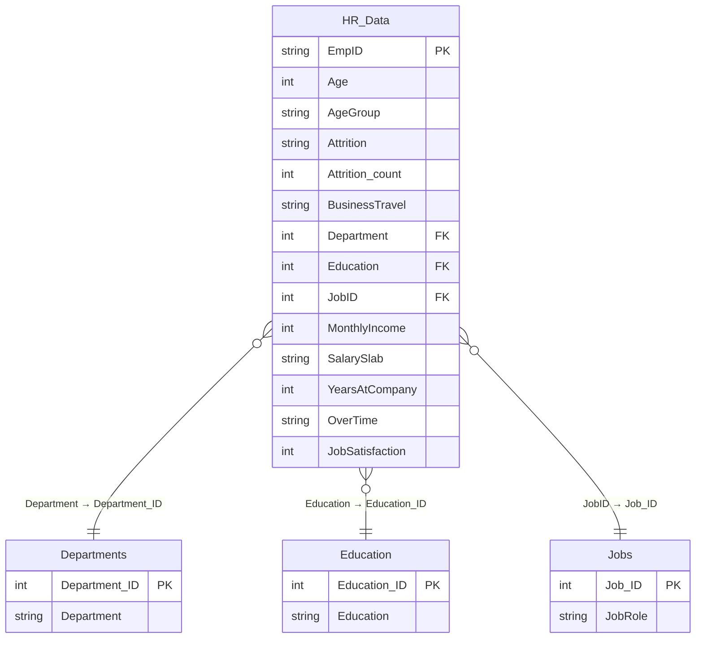

# 📊 HR Attrition Analytics Dashboard

**A single-page Power BI dashboard that diagnoses *why* employees leave — broken down by department, job role, salary band, tenure, and satisfaction — built on a proper star-schema data model with 7 DAX measures.**


---

## 🖼️ Dashboard Preview



*Dark "Night Quartz" theme, one-page executive view — 6 KPI cards, a gender-split treemap, 3 bar/column charts, a donut chart, an area chart, and a job role × satisfaction pivot table, all cross-filtered by a department slicer.*

### 🔍 Interactive Filtering — Department Slicer in Action



*Clicking **Research & Development** on the slicer instantly recalculates every visual on the page — headcount drops to 961, attrition falls to 13.84% (below the 16.2% company average), and the salary donut reshapes to show 82.71% of R&D staff sitting in the "Upto 5k" band. This is the same page, zero extra clicks beyond the slicer — every card, chart, and the pivot table re-render together.*

---

## 📌 Table of Contents

- [Business Problem](#-business-problem)
- [Dataset](#-dataset)
- [Data Model](#-data-model)
- [DAX Measures](#-dax-measures)
- [Dashboard Walkthrough](#-dashboard-walkthrough)
- [Key Insights](#-key-insights)
- [Tools & Tech Stack](#-tools--tech-stack)
- [Repository Structure](#-repository-structure)
- [How to Use](#-how-to-use)
- [Author](#-author)

---

## 🎯 Business Problem

Employee attrition is expensive — replacing a mid-level employee typically costs 6–9 months of their salary in recruiting, onboarding, and lost productivity. HR leadership needed a single view that could answer:

- **Which departments and job roles bleed the most talent?**
- **Is attrition concentrated in a salary band, age group, or tenure range?**
- **Does overtime, job satisfaction, or job involvement correlate with people leaving?**
- **What's the overall attrition rate, and how does it move when we slice by department?**

This dashboard turns those questions into a two-second glance instead of a spreadsheet pivot exercise.

---

## 🗂️ Dataset

Built on the well-known **IBM HR Analytics Employee Attrition & Performance** dataset (sourced as an Excel workbook), covering:

| Metric | Value |
|---|---|
| Total employee records | 1,480 rows |
| Unique employees | 1,470 |
| Attributes per employee | 39 (demographics, compensation, satisfaction, performance, tenure) |
| Departments | Research & Development, Sales, Human Resources |
| Job roles | 9 (Research Scientist, Sales Executive, Manager, Lab Technician, etc.) |
| Education fields | 6 (Life Sciences, Medical, Marketing, Technical Degree, HR, Other) |

Raw categorical fields like Department, Education, and Job Role are stored as **surrogate keys** in the fact table and resolved through dedicated lookup tables — not left as flat text — which is what makes the model relationally correct instead of a single denormalized sheet.

---

## 🧩 Data Model

The model follows a clean **star schema**: one fact table surrounded by three dimension tables, plus a dedicated hidden measures table (best practice for keeping DAX measures organized and separate from raw columns).



**Why a measures table?** All 6 active DAX measures live in a standalone `_measure_table` disconnected from any relationship — a modeling convention that keeps the fields list clean and makes measures easy to find, instead of burying them under whichever fact table they were written against.

**One calculated column:** `Attrition_count` on `HR_Data`, which flags each leaver as `1` so it can be summed and used inside rate calculations:

```dax
Attrition_count =
IF(HR_Data[Attrition] = "Yes", 1, 0)
```

---

## 🧮 DAX Measures

| Measure | DAX | Purpose |
|---|---|---|
| **Total_Employee** | `DISTINCTCOUNT(HR_Data[EmpID])` | Unique headcount, immune to any duplicate rows in the source |
| **Attrition_count** | `SUM(HR_Data[Attrition_count])` | Total number of employees who left |
| **Attriiton_Rate** | `DIVIDE([Attrition_count], [Total_Employee], 0)` | Safe-divide attrition rate (0 fallback avoids divide-by-zero errors when a slicer selection returns no employees) |
| **Avg_Age** | `AVERAGE(HR_Data[Age])` | Average workforce age |
| **Avg_salary** | `AVERAGE(HR_Data[MonthlyIncome])` | Average monthly income |
| **Avg_working_years** | `AVERAGE(HR_Data[YearsAtCompany])` | Average tenure, a proxy for institutional knowledge at risk |

All measures respond live to the department slicer and any cross-filter from the visuals — the KPI card row updates instantly with each click.

---

## 📊 Dashboard Walkthrough

| Visual | Type | Fields | What it answers |
|---|---|---|---|
| KPI strip | Card group | All 6 measures | The headline numbers at a glance |
| Attrition by Gender | Treemap | Gender → Attrition_count | Is attrition skewed by gender? |
| Attrition by Education | Bar chart | Education → Attrition_count | Which education background leaves most? |
| Attrition by Salary Band | Donut chart | SalarySlab → Attrition_count | Is attrition concentrated in lower pay bands? |
| Job Role × Job Satisfaction | Pivot table (matrix) | JobRole (rows) × JobSatisfaction (columns) → Attrition_count | Cross-tab of *who* is leaving and *how satisfied* they were |
| Attrition by Job Role | Bar chart | JobRole → Attrition_count | Which roles have the highest churn |
| Attrition by Tenure | Area chart | YearsAtCompany → Attrition_count | Does attrition spike early (onboarding) or late (career plateau)? |
| Attrition by Age Group | Column chart | AgeGroup → Attrition_count | Which age bracket is most at risk |
| Department slicer | Advanced slicer | Department | Filters the entire page by R&D / Sales / HR |

---

## 💡 Key Insights

Numbers below are computed directly from the underlying data model:

- **Overall attrition rate: 16.2%** — 238 of 1,470 employees left, roughly in line with the well-documented benchmark for this dataset.
- **Overtime is the single strongest attrition signal in the data**: employees who work overtime leave at **~30.6%**, nearly **3x** the rate of those who don't (**~10.4%**).
- **Sales has the highest departmental churn** at **~20.7%**, ahead of HR (**~19.0%**) and Research & Development (**~13.8%**) — despite R&D being by far the largest department (967 employees).
- **Men leave at a higher rate (17.0%) than women (14.7%)** in this workforce, though the gap is modest.
- **Salary compression at the bottom hurts retention**: over half the workforce (753 employees) sits in the "Upto 5k" monthly income band, and lower salary slabs disproportionately drive the attrition count in the donut chart.
- **Average tenure is just over 7 years**, with the area chart showing churn is not purely an early-career problem — it's spread across tenure bands.

*(These are the insights the dashboard makes visible in one glance — no cross-referencing spreadsheets required.)*

---

## 🛠️ Tools & Tech Stack


- **Power BI Desktop** — data modeling, DAX, report design
- **Power Query (M)** — Excel ingestion and shaping for all 4 tables
- **DAX** — 6 measures + 1 calculated column, all disconnected in a dedicated measures table
- **Night Quartz** dark theme — for a clean, executive-ready presentation

---

## 📁 Repository Structure

```
HR-Attrition-Analytics-Dashboard/
├── README.md
├── assets/
│   └── dashboard-preview.png
└── HR Attrition Analytics.pbix
```

---

## 🚀 How to Use

1. Clone this repository.
2. Open `HR Attrition Analytics.pbix` in **Power BI Desktop** (2023+ recommended).
3. Use the department slicer top-right to filter the entire page.
4. Hover any visual for exact tooltips, or right-click → **Drill through** on the pivot table for role-level detail.

---

## 👤 Author

**Md Ibrahim (Shawon)** — Junior Data Analyst | Business Intelligence Developer | Automation Enthusiast

Turning raw data into actionable business intelligence through Power BI, DAX, SQL, and Python-based automation.

- 💻 GitHub: [@ibrahim-analyst-shanto](https://github.com/ibrahim-analyst-shanto)
- 📧 Email: ibrahim.analyst.data@gmail.com

---

⭐ **If this project helped you understand HR analytics or Power BI data modeling, consider giving it a star!**
